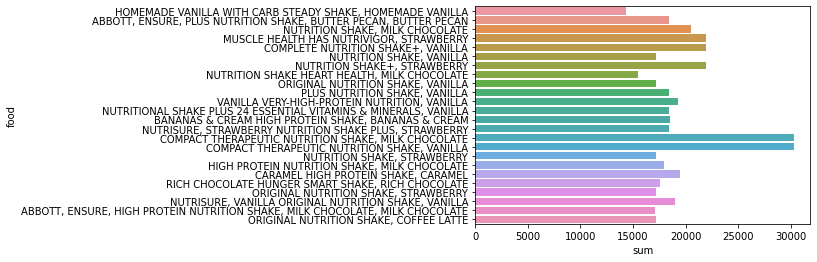

# PipeLines _proy2

 

# Supreme ultimate food!.
Whats the most powerfull food, by this I mean, wich food in particular is the one that has the most valriable nutrients, that helps you with some diseases.

### Since when to a good eating habbits we started named it diet?

Theres always a feeling of sicknes walking throw our body, and the first thing most of people do is to go to the nearest farmaci and swalow bunch of pills every day, what if I tell you that everything you need is inside the food you eat, just have to know what type of food is good for what disease.

In this proyect I´m going to compare just a few diseases and what lack of nutrients cause them. and from that I would gather the information to check witch food is the one that contains the most common nutrients that this few diseases add, that food would become the supreme ultimate food.

 
## Data analsys.
I investigate from 2 sites, the USDA data base that it was already available for us in a .csv format and from a web page that gives us information about some diseases and their lack of nutrients.
### 1. USDA database.
The USDA database of foods its really extense and complete with more than 1,185,081 foods. Its a data base of all the aliments that are in the market to buy in the United states. They have a lot of information like: the lab proceses, where they sell them, wich store, and what we are interested is the nutrients they have.

I had to do a lot od cleaning and searching for what it acctualy it was going to be helpfull for the proyect. Had to:

- Did some searching and selection of the dataframes that I would need, from the almost 15 tables I stay with 3 or 4.
- Had to do some cleanng on the columns that each dataframe had, stayed with just a few of them.
- Needed to change the names of the left columns, to matched the same value in the different dataframes.
- Merged the cleaned and filtered dataframes to a unique one, with only the information that would be helpful for this proyect
- Deleted all the duplicated columns and grouped it by the name of the food, there where acctualy a lot of food with the same name but they where different product, different brand. 

 
### 2. Health web scraping.
I got this information from the Encyclopedia Britannica web page, I started looking for diseases and what acctualy couse them, but at the end I got to a page with complete oposite information, "what nutrient coauses what disease" but it was still a good information. I had to:

- 
- 

  
## Analizing.
After we create both tables with the information that we wanted, its time to merge the information to a single dataframe. 

  

 

## Conclution. 
It depends of what acctualy is what we are loocking for, because I can have the aliment with the most number of diferent nutrients but that doesnt mean that it has the most cuantity per grams.

1. the one that has the most number of nutrients is .....

2. the one that has the most cuantity of nutrients per gram is ... with .... number of diferent nutrients

  

